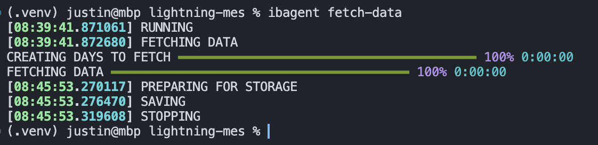

# Lightning MES

<!-- # Copyright Justin R. Goheen.
#
# Licensed under the Apache License, Version 2.0 (the "License");
# you may not use this file except in compliance with the License.
# You may obtain a copy of the License at
#
#     http://www.apache.org/licenses/LICENSE-2.0
#
# Unless required by applicable law or agreed to in writing, software
# distributed under the License is distributed on an "AS IS" BASIS,
# WITHOUT WARRANTIES OR CONDITIONS OF ANY KIND, either express or implied.
# See the License for the specific language governing permissions and
# limitations under the License. -->

This is repo enables the creation of artificially intelligent trading agents using [Lightning AI](https://lightning.ai/)'s PyTorch Lightning, Fabric, and TorchMetrics, along with [Nixtla](https://www.nixtla.io/)'s timeseries forecasting frameworks. The market and data broker is [Interactive Brokers](https://www.interactivebrokers.com/en/home.php) – users must have an IBKR Pro account and be subscribed to the correct data.

[MES](https://www.cmegroup.com/markets/equities/sp/micro-e-mini-sandp-500.html) (SPX micro e-mini) is used in examples.

## IBKR Accounts

If you are already an IBKR customer, you will need to be on the "Pro" plan. If you aren't already a client, here is the link for a demo account https://www.interactivebrokers.com/en/trading/free-trial.php.

### IBKR TraderWorkstation

TWS provides access to a trading API. The platform must be open to access the API, and connections to the API must be enabled. You can find initial setup instruction with the following link:

https://interactivebrokers.github.io/tws-api/initial_setup.html#enable_api

## Preparing to use Lightning MES

Fork then clone the repo. After cloning the repo to your machine, do the following in terminal:

```bash
cd {{ path to clone }}
python3 -m venv .venv/
source .venv/bin/activate
pip install -e .
```

## Required Dependencies and Extras

The instructions shown above will install the base requirements, those requirements are:

- Lightning: PyTorch Lightning, TorchMetrics, Fabric
- PyTorch
- ib_insync: highly recommended third party framework for IBKR API
- pandas
- pyarrow: creating parquet files, my preferred file format over CSV
- supabase: an open source data storage provider for storage buckets and PostgreSQL
- click: command line interface framework that replaces Python's argparse

### Extras

Installing only the base requirements is acceptable if you have your own opinionated stack for docs, testing, and code quality. If you are okay with my tooling for these tasks, you can install the full suite show in [setup.cfg](./setup.cfg) with the following:

```bash
# if not already in repo, go to repo
cd {{ path to clone }}
# if no .venv exists, create one
python3 -m venv .venv/
# activate the virtual environment
source .venv/bin/activate
# install the extras
pip install -e ".[all]"
# install pre-commit hooks
pre-commit install
```

#### Notable Extras

The Nixtla suite of timeseries forecasting frameworks will be used during the machine learning phase of this project. The Nixtla suite consists of:

- statsforecast
- neuralforecast
- mlforecast
- hierarchicalforecast
- tsfeatures

## Running the App

To run the app, ensure you have TWS running – I suggest logging into the paper trading portal to safely test the app.

The current `ib_port` setting in `mes_agent.core.fetch.FetchWork` defaults to the paper trading port – you must change this to the live trading port if you've logged into live trading.

Once the above is complete, do the following in terminal:

```bash
ibagent fetch-data
```

So long as the install is correct, running the above will display the following in terminal:


